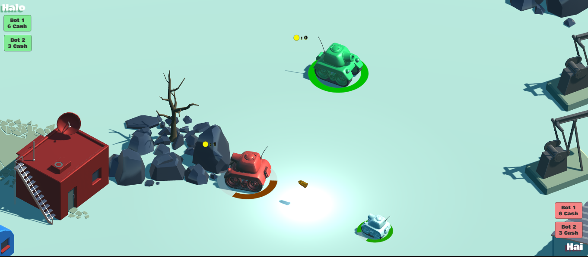

# IF3210-2021-Unity-K3-1
Tugas Besar 2 IF3210 Pengembangan Aplikasi pada Platform Khusus - Tanks: Extended

## Deskripsi Aplikasi
Aplikasi ini adalah sebuah game 3D top-down dengan dua mode gameplay, yaitu tank battle royale (main game) dan tank timed game. Permainan ini adalah ekstensi dari <a href ='https://learn.unity.com/project/tanks-tutorial'>Tanks - Unity Learn</a> Game ini dapat dimainkan oleh 2 orang pemain. Pada mode gameplay tank battle rolaye (main game), permainan terdiri atas 5 ronde. Pada setiap ronde, pemain menyerang dengan cara menembakan peluru ke tank lawan sampai salah satu tank kehabisan health points. Selain itu terdapat pula cash yang dapat dikumpulkan oleh pemain yang dapat digunakan untuk membeli 2 jenis senjata lainnya dan 2 jenis bot yang dapat membantu pemain menyerang lawan. Pada timed game mode, pemain harus mengumpulkan cash sebanyak mungkin untuk memenangkan permainan.  

## Cara Kerja
1. Main menu - spek b  
sebelum pemain memasuki bagian gameplay, pemain dapat memilih `game mode` dan`jenis map`, mengisi `nama pemain`, dan mengatur `volume suara` menggunakan slider. Nama pemain dan volume suara disimpan dalam `PlayerPrefs`. Untuk mengatur volume suara, kami mengatur bagian sound mixer sesuai value dari input yang pengguna masukkan pada slider.

2. Desain map - spek c dan tambahan 1  
Terdapat `dua jenis desain map` yang dapat dipilih, yaitu `SnowLand` dan `Forest`. Map berupa prefabs level art dan level art 1. Setiap object pada map memiliki collider. Map yang terpilih akan di spawn.

3. Cash Object - spek d  
Object cash akan di-spawn di tempat random di seluruh peta secara periodik. Pemain dapat mengumpulkan object cash ketika object Tank collide dengan object cash tersebut. Jumlah dari cash yang dimiliki pemain diatur dalam sebuah script TankCash.cs

4. Jenis senjata - spek e  
Terdapat 2 jenis senjata yang dapat dibeli dengan cash, yaitu senjata jenis wide seharga 5 cash dan senjata jenis heavy seharga 10 cash. Senjata jenis wide memberikan dampak explosion yang lebih luas dibanding senjata normal, sedangkan senjata jenis heavy memberikan damage lebih besar.

5. Karakter bergerak (Bot) - spek f, g, h  
Terdapat `dua jenis karakter bergerak` yang dapat dibeli menggunakan cash. Kami mengimplementasikan karakter ini sebagai Bot1 dan Bot2 pada prefabs. Bot1 dapat dibeli dengan 6 cash dan berupa infantry yang bergerak mengikuti tank lawan dari belakang dan menembak secara periodik. Sedangkan bot2 dapat dibeli dengan 3 cash dan berperan sebagai NPC ally yang bergerak di samping depan pemain dan menembak secara periodik. Kedua jenis karakter ini juga memliki `animasi`. Ketika bergerak (berjalan), animasi karakter berupa pergerakan tanks ke kanan dan ke kiri (rotasi sumbu Y), ketika menembak animasi berupa rotasi sumbu X, sehingga bagian depan tank karakter bergerak naik ke atas, dan ketika berputar, bagian atas tank karakter (turret) berotasi terhadap sumbu Y. Animasi kami implementasikan menggunakan animation controller dengan masing-masing satu state untuk setiap animasi (berjalan, menembak, dan berputar) yang dipanggil ketika karakter melakukan aksi tersebut. Tanks dan karakter bergerak juga memiliki collision dan karakter bergerak bisa diserang menggunakan peluru pemain dan menghilang ketika healths nya sudah habis.

6. Mode game - spek tambahan 2  
Game mode lain yang diimplementasikan adalah timed mode. Kedua pemain harus mengumpulkan cash sebanyak mungkin dalam kurun waktu tertentu. Pemain dengan cash terbanyak akan menjadi pemenang.

7. Object Pooling - Spek tambahan 3 <rb/>
Object Pooling kami implementasikan untuk object cash. Object ini memiliki Prefab yang disimpan sehingga dapat digunakan berulang-ulang dan tidak perlu melakukan instantiate dan destroy berulang-ulang.

### Assets yang digunakan
* https://assetstore.unity.com/packages/3d/environments/landscapes/low-poly-simple-nature-pack-162153

### Library yang digunakan
Libray yang digunakan merupakan library native yang telah disediakan oleh C# dan Unity, yaitu:
* UnityEngine.UI : digunakan untuk mengubah tampilan komponen UI, seperti mengubah isi text pada UI.
* UnityEngine.Audio : digunakan untuk mengubah volume suara.

### ScreenShot aplikasi
#### Tampilan awal permainan 

#### Tampilan main menu settings 

#### Pemilihan game mode 

#### Game Play untuk battle royal (main mode) 
 
 
Bot 1 (NPC ally) 
 
Bot 2 (Infantry) 
 
Membeli jenis senjata 
 
Senjata jenis heavy 
 
Senjata jenis wide 
 

#### Game Play untuk timed mode 
Dengan peta pertama (snowland)  
 
Dengan peta kedua (forest) 
 

### Pembagian Kerja
NIM | Nama | Pekerjaan |
--- | --- | --- |
13518009 | Aufa Fadhlurohman | Game mode kedua (timed game) |
13518045 | Anna Elvira Hartoyo | Main menu (setting nama player, sound, map)   Dua jenis tampilan map   Dua jenis karakter bergerak dan animasi karakter bergerak   Object Pooling |
13518063 | Dhafin Rayhan Ahmad | Object cash   Dua jenis senjata berbeda |
